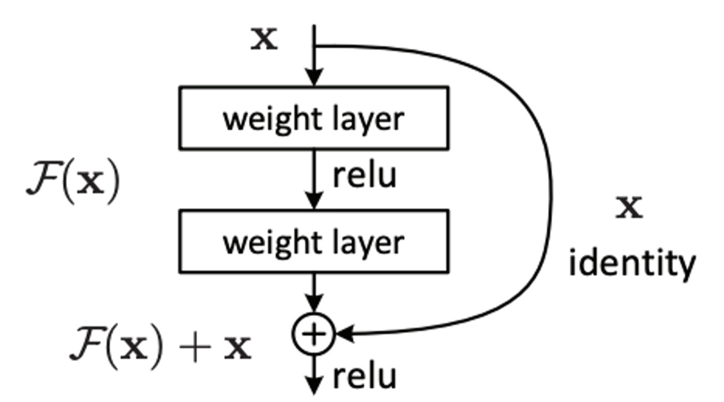
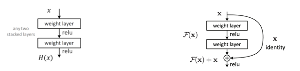
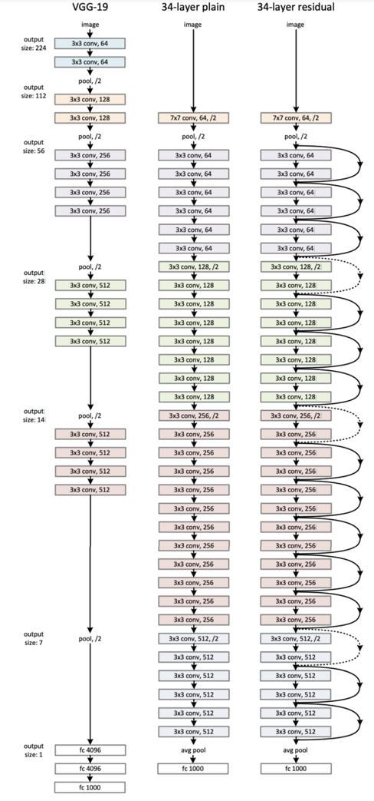

# 논문 요약

---

지금까지 네트워크 성능 향상을 위해 layer를 깊게 쌓는 연구가 계속되었다. 하지만 깊은 신경망은 학습이 어렵다. 본 연구에서는 residual learning을 통해 깊은 네트워크에서도 네크워크 학습을 쉽게 하면서도 좋은 성능을 낼 수 있음을 제시한다. 

실제로 내재한 mapping인 H(x)를 학습하기보다 F(x) := H(x) - x를 학습함으로써 학습 난이도를 낮추고 extremely deep network 에서도 최적화를 쉽게 할 수 있고, 정확도 향상이 가능하다.  

Residual learning (A building block)

# 관련 아이디어

---

### 1. Residual Representation

좋은 Reformulation(산식 재정의)이나 Preconditioning을 통해 최적화를 단순화 할 수 있다는 연구에 대한 내용이다.

기존 이미지 인식에서 대표적으로 residual vector를 인코딩한 VLAD나, VLAD를 확률론적으로 산식을 만든 Fisher vector등의 알고리즘이 있다. 

### 2. Shortcut Connection

shortcut connection에 대한 연구는 예전부터 활발히 진행되어 왔다. MLP에서 input과 output 사이에 linear layer를 추가하거나 Inception layer에서 shortcut branch를 추가하는 연구등이 있다. 

본 연구의 shortcut connection의 반대 비교로 highway network가 있다. 해당 network의 gate는 데이터에 대해서 독립적(data-dependent)이고 학습해야 할 파라미터를 가지는 반면, 본 연구의 identity shortcut은 파라미터가 없다(parameter-free)는 특징이 있다. 또한 highway network의 shorcut이 ‘closed’(값이 0에 수렴) 된다면 해당 layer는 non-residual 함수를 나타는 것이다. 하지만 identity shortcut의 식(formula)는 절대 닫히지 않고 항상 모든 정보가 지나감으로써 항상 residual function을 학습한다는 장점이 있다. 

# 핵심 아이디어

---

### 1. Residual Learning

`H(x)` : 몇 개의 layer에 맞는 기본 mapping

`x` : 위에 정의된 layer에 들어가는 Input

`가정1` : 여러개의 비선형 레이어가 복잡한 함수를 근사할 수 있으면 점차적으로 residual function도 근사할 수 있을 것이다.

상단 왼쪽 그림의 plain net에서 원래 학습해야 하는 mapping은 H(x)지만 상단 오른쪽 그림과 같이 $H(x) := F(x) + x$로 재정의 할 수 있다. 

(이 때 $F = W_2\sigma(W_1 x)$의 $\sigma$는 ReLU를 뜻한다.)

**즉, 재정의 된 $F(x)$를 학습함으로써 H(x)를 학습하는 것과 차이가 없게 느껴질 수 있지만, 학습 난이도를 훨씬 떨어뜨릴 수 있다.** 

### 2. Identity Mapping by Shortcut

몇 개의 Layer를 묶어서 모든 묶음에 residual learning을 적용한다.

$$ y = F(x, \{ W_i \}) + x $$ 

($`F`$ : residual mapping $`x`$ : identity mapping)

여기서 x, F의 차원은 같아야 하는데, 만약 같지 않다면 다음과 같은 연산을 추가하여 맞춰준다

$y = F(x, \{ W_i \}) + W_sx$

**identity mapping은 앞서 학습한 정보를 그대로 가져온다고 이해할 수 있다.** 

# 구현

---

- 데이터는 Image Net 데이터를 사용하여 다음과 같은 전처리를 적용한다
    - 크기 : 224 * 224
    - randomly crop
    - horizontal flip
    - per-pixel mean substracted
    - standard color augmentation
- 각 convolution과 activation 사이에 batch normalization 적용
- 가중치 초기화는 scratch
- SGD 사용, mini-batch 크기는 256
- 학습속도는 0.1로 시작하되 에러 안정 후 10으로 나눈 속도 적용
- iteration은 $60*10^4$
- weight decay : 0.0001, momentum: 0.9
- dropout 사용하지 않음

# 연구 성과

---

- VGG net 보다 8배나 깊은 152 layer를 가지고도 낮은 복잡도 유지
- ILSVRC2015 imagenet 에서 1위 (에러 3.57%)
- Object detection등 다른 분야에서도 좋은 성능
- 이전 아키텍쳐와 다르게 layer가 깊어져도 좋은 성능을 유지 (하지만 과도하게 깊으면 오히려 감소)